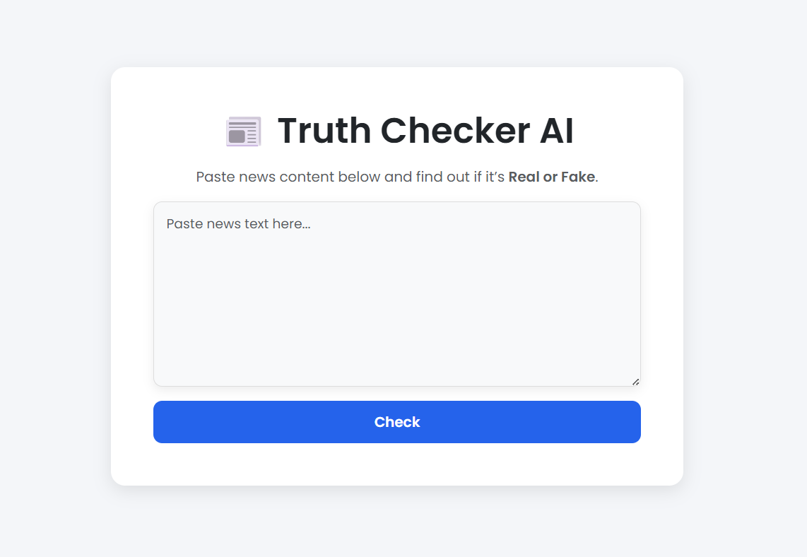
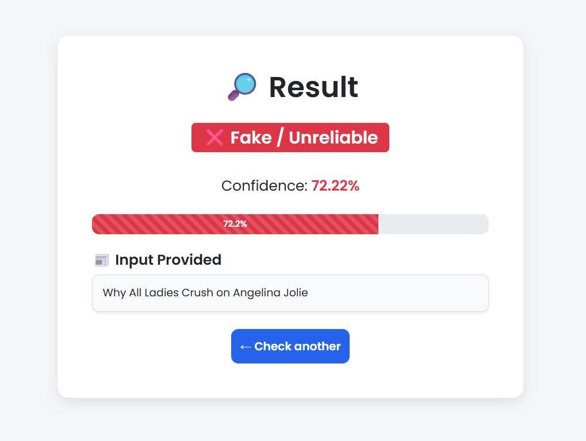
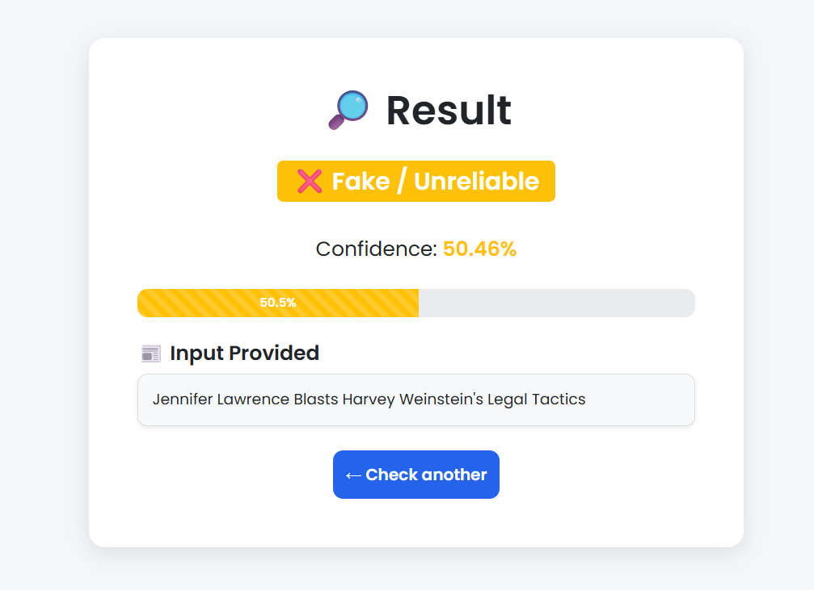

# 📰 Truth Checker AI


🚀 Truth Checker AI is a machine learning tool that
classifies news articles/headlines/Source domain/URLs as Real ✅ or 
Fake ❌ using Logistic Regression + TF-IDF.

## ✨Features
- 📂Reads dataset of news headlines/articles (.csv)
- 🧹Cleans and preprocesses text (stopwords removal, tokenization)
- 🤖Classifies input text as Real News ✅ or Fake News ❌
- 💾Pre-trained model saved in models/ for reuse
- 🛠️Modular code: 
  - train_model.py (training) 
  - main.py (prediction)

## 🛠️Tech Stack
- Python 3.10
- Pandas, NumPy, Scikit-learn
- NLTK (Natural Language Toolkit)
- Joblib (model persistence)
- Flask (Web Application Framework) 
- Git & GitHub for version control

## 📂Project Structure
```markdown
truth-checker-ai/

├── 📂 dataset/            # CSV dataset of news
├── 📂 models/             # Saved ML model & vectorizer
├── 📂 src/                # Core scripts
│   ├── 🧠 train_model.py  # Train and save your model
│   └── 🎯 main.py         # Predict news authenticity
│   └── 🌐 app.py          # Flask web application
│   └── 📂 templates/      # HTML templates for Flask app
│       ├── 🏠 index.html  # Home page
│       └── 📄 result.html # Result page
│   └──📂 static/          # Static files for Flask app
│       └── 🎨 style.css   # css styling
├── 📄 requirements.txt    # Project dependencies
└── 📘 README.md           # Project overview and instructions
```

## ⚡How to Run

### 1️⃣Clone the repository & set up a virtual environment

```bash

git clone https://github.com/anoodh-ai/truth-checker-ai.git
cd truth-checker-ai
python -m venv .venv
.venv\Scripts\activate   # For Windows
#.venv/bin/activate      # For Mac/Linux
pip install -r requirements.txt
```
### 2️⃣Train the model (if needed)
```bash

python src/train_model.py
```
### 3️⃣Run prediction script _(For Developers)_
```bash

python src/main.py
```
### 💡Example Output
```bash
Enter news text: Gwen Stefani Got Dumped by Blake Shelton Over "Jealousy and Drama"
✅ Real News

Enter news text: Kandi Burruss Explodes Over Rape Accusation on 'Real Housewives of Atlanta' Reunion (Video)
❌ Fake News

```


### 4️⃣Run Flask Web App _(for Anyone)_
```bash

python src/app.py
```
## 📸 Screenshots

 💡Example Output
 





## 📂 Dataset  
```markdown
This project uses the 📰 Fake News Detection Dataset from Kaggle:  
👉 [🔗 Fake News Detection Dataset (Kaggle)] (https://www.kaggle.com/)  

📊 Size : ~23,196 news articles  

✨Features :  
 🏷️ Title  
 🌐 News URL  
 🏛️ Source Domain  
 🐦 Tweet Count  
 🧾 Real  

🔖Label Meaning :  
 `0️⃣` → ❌ Fake News  
 `1️⃣` → ✅ Real News  
```


## 📊Accuracy

- ✅ Training/Test dataset: ~92% 
- 🌍 Real-world expected accuracy: 80–85%

>**_⚠️ Accuracy may vary in real-world use due to misinformation trends.
Regular retraining with updated datasets is recommended._**

## 🚀Future Improvements

- 🌐Support for multiple languages
- 🧠Deep Learning models (LSTMs / Transformers)
- 🔄Continuous learning from live news feeds


## 👩‍💻 Developer  
```markdown
👤 [Anoodh A] (https://github.com/anoodh-ai) 
```
---
 ## 📜 License

MIT License — see [LICENSE] for details.
> _📌This project is for learning & inspiration. Please credit the author (Anoodh A) if reused._
